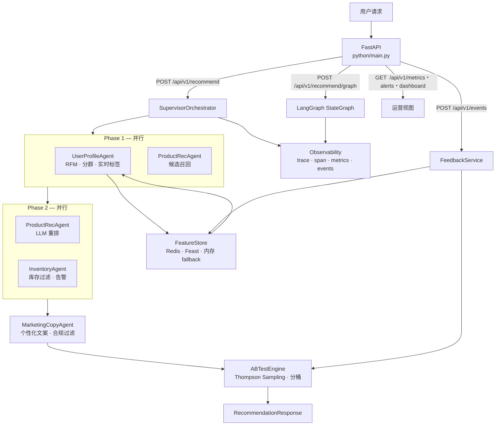

# Multi-Agent E-Commerce Recommendation System

基于 Python 的企业级多 Agent 电商推荐与营销系统。用 Supervisor 两阶段并行编排四个专业 Agent，形成从用户画像 → 商品推荐 → 库存校验 → 个性化文案的完整闭环，内置 A/B 实验、反馈回路和全链路可观测。

**Tech Stack**

`FastAPI` · `LangGraph` · `LangChain` · `Feast` · `Redis` · `asyncio` · `Thompson Sampling` · `Docker`

**Key Results**

| 指标 | 数值 |
|---|---|
| CTR 相对提升（Thompson Sampling vs 静态分桶） | **+16.44%** |
| 单元 / 集成测试 | **59 passed** |
| 推荐链路端到端 | Supervisor 两阶段并行，Phase1 + Phase2 各自异步并发 |

---

## 系统架构



---

## 核心模块

### Agent 层

| Agent | 职责 |
|---|---|
| `UserProfileAgent` | 聚合实时行为，计算 RFM，选择用户分群，可异步 LLM 刷新画像 |
| `ProductRecAgent` | 候选召回 → LLM 重排，按偏好 / 价格 / 多样性排序 |
| `InventoryAgent` | 过滤缺货 SKU，低库存触发 warning / critical 告警 |
| `MarketingCopyAgent` | 按分群选模板，按实验组切 copy_style，内置敏感词过滤 |

所有 Agent 继承 `BaseAgent`，统一获得：指数退避 retry · 超时强制中断 · fallback 元数据 · agent span。

### 服务分层

```
python/services/
├── experimentation/    A/B 分桶、Thompson Sampling、CTR simulation、反馈闭环
├── features/           FeatureStore (Redis/内存 fallback) + FeastFeatureStore
├── operations/         业务指标、库存告警、阈值告警、dashboard
├── observability/      trace/span、事件缓冲区、metric registry、token 用量
├── reliability/        错误分类、retry policy、fallback handler
└── user_profile/       分群选择、画像标准字段
```

### 实验结果

Thompson Sampling 多臂 Bandit vs 静态 50/50 分桶，100,000 轮模拟：

```
Baseline  CTR: ~2.10%
Thompson  CTR: ~2.42%
相对提升:  +16.44%  ✓ evaluation_passed
```

---

## 快速启动

### 本地运行

```bash
cd python
python -m venv .venv && source .venv/bin/activate  # Windows: .venv\Scripts\activate
pip install -r requirements.txt
cp .env.example .env        # 填写 ECOM_LLM_API_KEY
python main.py              # → http://localhost:8002
```

### Docker Compose

```bash
cp python/.env.example python/.env   # 填写 ECOM_LLM_API_KEY
docker compose up -d --build api redis milvus
# → http://localhost:8000
```

### 调用示例

```bash
curl -X POST http://localhost:8000/api/v1/recommend \
  -H "Content-Type: application/json" \
  -d '{"user_id":"user_001","scene":"homepage","num_items":5,"context":{"recent_views":["手机","耳机"],"avg_order_amount":500}}'
```

---

## API 一览

| 方法 | 路径 | 说明 |
|---|---|---|
| `POST` | `/api/v1/recommend` | Supervisor 推荐主链路 |
| `POST` | `/api/v1/recommend/graph` | LangGraph 推荐链路 |
| `POST` | `/api/v1/events` | 写入曝光 / 点击 / 购买反馈 |
| `GET` | `/api/v1/experiments` | A/B 实验状态与后验 |
| `GET` | `/api/v1/metrics` | 指标 + 告警 + 观测快照 |
| `GET` | `/api/v1/dashboard` | 聚合监控面板 |
| `GET` | `/features/{user_id}` | 用户实时特征 |
| `GET` | `/health` | 健康检查 |

---

## 目录结构

```
multi-agent-ecommerce-system/
├── docker-compose.yml
├── docs/                       架构文档 / 项目计划
├── .github/workflows/          CI（测试 + CTR simulation 冒烟）
└── python/
    ├── main.py                 FastAPI 入口
    ├── agents/                 4 个专业 Agent + BaseAgent
    ├── orchestrator/           Supervisor + LangGraph
    ├── services/               运行时服务层（见上方分层图）
    ├── evaluation/             离线评估框架
    ├── scripts/                CTR 实验脚本 + Feast 数据准备
    ├── load_tests/             Locust 压测
    ├── artifacts/simulations/  实验产物（JSON）
    └── tests/                  59 项测试
```

---

## 测试 & CI

```bash
python -m pytest python/tests -v   # 59 passed
```

CI 自动运行：lint · 单元测试 · Feast CTR simulation 端到端验证（见 `.github/workflows/`）。

---

## 配置

复制 `python/.env.example` 为 `python/.env`，填写以下必填项：

```bash
ECOM_LLM_API_KEY=<your-key>          # 兼容 OpenAI 接口的任意 LLM
ECOM_LLM_BASE_URL=https://dashscope.aliyuncs.com/compatible-mode/v1
ECOM_LLM_MODEL=qwen3.7-plus
```
