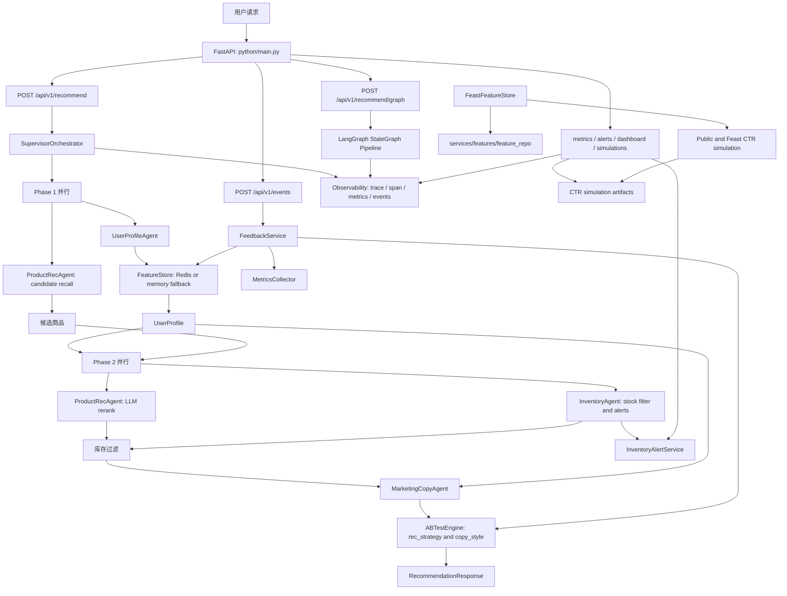

# 多 Agent 电商推荐与营销系统

## 一、项目定位

本项目是一个 Python-only 的多 Agent 电商推荐与营销系统。核心目标是用 Supervisor 编排用户画像、商品推荐、库存决策、营销文案、A/B 实验、反馈闭环和可观测能力，形成一条可运行、可评估、可监控的推荐链路。

核心能力：

- 推荐链路：FastAPI 接收请求，Supervisor 并行编排 4 个专业 Agent，输出商品推荐和个性化文案。
- 特征闭环：行为事件写入 FeatureStore，实时聚合用户画像特征，Feast 提供在线特征实验能力。
- 实验优化：支持 hash 分桶、Thompson Sampling、分群后验、Public/Feast CTR simulation。
- 运行保障：BaseAgent 提供 retry、timeout、fallback；observability 模块记录 trace、span、metric、event。
- 运维视图：指标、库存告警、阈值告警、dashboard 和 simulation artifact 可通过 API 查看。

主要技术栈：

- Web/API：FastAPI、Uvicorn、Pydantic
- 编排：SupervisorOrchestrator、LangGraph StateGraph、asyncio
- Agent：LangChain、OpenAI-compatible ChatOpenAI、DashScope `qwen3.7-plus`
- 特征：Redis、Feast、内存 fallback、Parquet
- 实验与评估：A/B hash bucket、Thompson Sampling、NumPy、Pandas
- 观测与可靠性：structlog、in-process metric registry、trace/event buffer、retry/fallback
- 部署：Docker Compose、Redis、Milvus、MySQL

---

## 二、项目架构设计

### 2.1 系统总览



系统入口集中在 `python/main.py`：

- `/api/v1/recommend`：生产推荐主链路，使用 `SupervisorOrchestrator`。
- `/api/v1/recommend/graph`：LangGraph 展示链路，使用 StateGraph 表达同类推荐 DAG。
- `/api/v1/events`：曝光、点击、加购、购买等反馈事件入口。
- `/api/v1/experiments`：查看 A/B 实验和后验状态。
- `/api/v1/metrics`：查看 Agent、业务、库存告警和观测快照。
- `/api/v1/alerts`、`/api/v1/dashboard`、`/api/v1/alerts/history`、`/api/v1/alerts/notifications`：运营告警视图。
- `/api/v1/simulations/ctr/{kind}`：读取 CTR simulation artifact。
- `/features/{user_id}`：查看用户实时特征。
- `/health`：健康检查和 simulation artifact 状态。

关键组件说明：

- `SupervisorOrchestrator`：两阶段并行编排，Phase 1 同时运行用户画像和商品候选召回，Phase 2 同时运行 LLM 重排和库存过滤，最大化并发减少链路延迟。
- `LangGraph StateGraph Pipeline`：用 StateGraph 将同一推荐 DAG 显式建图，便于可视化调试和链路扩展。
- `FeatureStore`：Redis Sorted Set 行为存储 + 内存 fallback，提供滑动窗口统计、RFM 计算和通用 JSON cache。
- `FeastFeatureStore`：延迟导入 Feast，读取 `services/features/feature_repo`，提供在线特征（view_count、avg_order_amount、rfm_score 等）用于 CTR 实验。
- `InventoryAlertService`：低库存阈值检测，告警信号写入 Observability 和 Operations 层，可通过 `/api/v1/alerts` 查看。
- `Public / Feast CTR Simulation`：100 000 轮 Thompson Sampling vs 静态 50/50 分桶对比，产物写入 `python/artifacts/simulations/`，相对 CTR 提升约 16%。

### 2.2 Agent 设计

**用户画像 Agent**

- 文件：`python/agents/user_profile_agent.py`
- 从 `FeatureStore` 读取用户行为、RFM、离线标签和实时标签。
- 支持画像缓存、homepage fast mode、规则 fallback、异步 LLM refresh。
- 输出标准化用户画像字段：用户分群、偏好类目、价格区间、近期行为、实时标签。

**商品推荐 Agent**

- 文件：`python/agents/product_rec_agent.py`
- 当前使用 mock 商品池做候选召回，保留 `vector_store` 注入点用于向量检索扩展。
- 有用户画像时按偏好类目、近期兴趣、价格区间、库存和随机多样性排序。
- 有画像时调用 LLM 做重排；解析失败时回退候选顺序。

**库存决策 Agent**

- 文件：`python/agents/inventory_agent.py`
- 使用商品 stock 字段做库存过滤。
- 低库存触发 warning/critical 告警信号。
- 根据库存深度和热门标签生成限购策略。

**营销文案 Agent**

- 文件：`python/agents/marketing_copy_agent.py`
- 根据用户分群选择文案模板。
- 支持 copy_style 实验组：formal、casual。
- 支持文案缓存、homepage fast mode 模板 fallback、异步 LLM refresh。
- 内置广告敏感词过滤。

### 2.3 服务分层

```text
python/services/
├─ experimentation/
│  ├─ ab_test.py          # A/B 分桶、Thompson Sampling、CTR simulation
│  ├─ feedback.py         # 用户行为反馈闭环
│  └─ simulation.py       # 数据飞轮模拟
├─ features/
│  ├─ store.py            # FeatureStore + FeastFeatureStore
│  ├─ aggregation.py      # 行为聚合到 Feast parquet
│  ├─ feature_store.yaml  # Feast 配置
│  └─ feature_repo/       # Feast feature repo
├─ operations/
│  ├─ metrics.py          # Agent 和业务指标聚合
│  ├─ inventory_alerts.py # 库存告警快照
│  └─ alerting.py         # 阈值告警、通知、dashboard
├─ observability/
│  ├─ tracing.py          # trace/span 上下文
│  ├─ events.py           # event buffer
│  ├─ metrics_registry.py # in-process metric registry
│  ├─ token_usage.py      # LLM token usage 提取
│  └─ schemas.py          # 观测数据结构
├─ reliability/
│  ├─ error_taxonomy.py   # 错误分类
│  ├─ retry_policy.py     # retry + timeout
│  └─ fallback_handler.py # fallback metadata
└─ user_profile/
   ├─ segment_selector.py # 用户主分群选择
   └─ standards.py        # 画像标准字段
```

### 2.4 数据与反馈闭环

```text
Behavior Event
└─ /api/v1/events
   └─ FeedbackService
      ├─ FeatureStore.record_behavior()
      ├─ ABTestEngine.record_metric()
      ├─ ABTestEngine.record_outcome()
      └─ MetricsCollector.record_business_event()

Recommendation
└─ SupervisorOrchestrator
   ├─ UserProfileAgent -> FeatureStore.get_user_features()
   ├─ ProductRecAgent -> candidate recall / LLM rerank
   ├─ InventoryAgent -> available product ids / low stock alerts
   ├─ MarketingCopyAgent -> personalized copies
   └─ ABTestEngine -> rec_strategy / copy_style
```

`FeatureStore` 当前支持：

- Redis Sorted Set 行为存储。
- 内存 fallback，便于本地测试和无 Redis 场景。
- 滑动窗口统计：1h、24h、7d。
- RFM 计算。
- 离线标签合并。
- 通用 JSON cache，用于画像和文案缓存。

`FeastFeatureStore` 当前支持：

- 延迟导入 Feast，避免无 Feast 环境直接崩溃。
- 从 `python/services/features/feature_repo` 读取 Feast repo。
- 获取 `view_count_1h`、`view_count_24h`、`view_count_7d`、`avg_order_amount`、`rfm_score`、`recent_views`。
- 用于 Feast 驱动 CTR simulation 和在线特征实验。

### 2.5 实验、评估与模拟

实验引擎位于 `python/services/experimentation/ab_test.py`：

- `rec_strategy`：control vs treatment_llm。
- `copy_style`：formal vs casual。
- `assign()`：基于 user_id + experiment_id 的一致性 hash 分桶。
- `assign_thompson()`：全局 Thompson Sampling。
- `assign_thompson_segmented()`：分群独立后验。
- `record_metric()`：记录实验指标，兼容 segment、scene、policy、trace_id。
- `get_stats()` 和 `get_segmented_stats()`：实验统计聚合。

评估与模拟：

- Public CTR simulation：`python/scripts/run_ctr_experiment.py`
- Feast CTR simulation：`python/scripts/run_ctr_experiment_feast.py`
- Feast 准备：`python -m services.features.aggregation`、`python/scripts/prepare_feast.py`
- 评估模块：`python/evaluation/`
- 产物目录：`python/artifacts/simulations/`

### 2.6 可观测与可靠性

`BaseAgent` 为所有 Agent 提供统一运行保障：

- retry policy
- timeout enforcement
- fallback metadata
- latency metric
- fallback metric
- agent span

可观测模块记录：

- workflow trace
- agent/tool/LLM/feature span
- workflow transition event
- token usage
- in-process metrics snapshot
- event buffer

运营模块提供：

- Agent 调用统计。
- 业务事件统计。
- 库存 warning/critical 快照。
- 阈值告警评估。
- dashboard 聚合视图。
- webhook 通知记录。

### 2.7 部署视图

```text
docker-compose.yml
├─ api    -> Python FastAPI container, host 8000 -> container 8002
├─ redis  -> behavior/features/cache
├─ milvus -> vector database service
└─ mysql  -> business data service
```

API 容器挂载 `./python:/app`，便于本地开发时代码即时同步。依赖变更后仍需 rebuild。

---

## 三、项目目录结构

```text
multi-agent-ecommerce-system/
├─ AGENTS.md
├─ README.md
├─ PROJECT_STATE.md
├─ docker-compose.yml
├─ plan.md
├─ skills-lock.json
├─ docs/
│  ├─ architecture.md
│  └─ project-plan.md
└─ python/
   ├─ Dockerfile
   ├─ main.py
   ├─ requirements.txt
   ├─ agents/
   │  ├─ base_agent.py
   │  ├─ inventory_agent.py
   │  ├─ marketing_copy_agent.py
   │  ├─ product_rec_agent.py
   │  └─ user_profile_agent.py
   ├─ config/
   │  └─ settings.py
   ├─ models/
   │  └─ schemas.py
   ├─ orchestrator/
   │  ├─ graph.py
   │  └─ supervisor.py
   ├─ services/
   │  ├─ experimentation/
   │  ├─ features/
   │  ├─ observability/
   │  ├─ operations/
   │  ├─ reliability/
   │  └─ user_profile/
   ├─ evaluation/
   ├─ scripts/
   │  ├─ generate_behavior.py
   │  ├─ prepare_feast.py
   │  ├─ run_ctr_experiment.py
   │  └─ run_ctr_experiment_feast.py
   ├─ load_tests/
   │  └─ locustfile.py
   ├─ artifacts/
   │  └─ simulations/
   └─ tests/
```

关键文件：

- `python/main.py`：FastAPI 入口、全局服务装配、API 路由。
- `python/orchestrator/supervisor.py`：生产推荐主链路。
- `python/orchestrator/graph.py`：LangGraph 推荐链路。
- `python/models/schemas.py`：请求、响应、AgentResult、商品、画像、反馈事件 schema。
- `python/config/settings.py`：`ECOM_` 环境变量配置。
- `python/services/features/store.py`：FeatureStore 和 FeastFeatureStore。
- `python/services/experimentation/ab_test.py`：A/B、Thompson、CTR simulation。
- `python/services/experimentation/feedback.py`：行为反馈闭环。
- `python/services/operations/alerting.py`：阈值告警和 dashboard。
- `python/evaluation/`：workflow、tool、latency、simulation、guardrail 评估。

---

## 四、API 与运行方式

### 4.1 本地运行

```bash
cd python
python -m venv .venv
.venv\Scripts\activate
pip install -r requirements.txt
python main.py
```

默认监听：

```text
http://localhost:8002
```

### 4.2 Docker Compose 运行

```bash
docker compose up -d --build api redis milvus mysql
```

服务映射：

```text
Python API: http://localhost:8000
Redis:      localhost:6379
Milvus:     localhost:19530
MySQL:      localhost:3306
```

### 4.3 API 清单

| 方法 | 路径 | 说明 |
| --- | --- | --- |
| `GET` | `/health` | 健康检查 |
| `GET` | `/features/{user_id}` | 用户实时特征 |
| `POST` | `/api/v1/recommend` | Supervisor 推荐主链路 |
| `POST` | `/api/v1/recommend/graph` | LangGraph 推荐链路 |
| `POST` | `/api/v1/events` | 行为反馈事件 |
| `GET` | `/api/v1/experiments` | A/B 实验状态 |
| `POST` | `/api/v1/experiments/{experiment_id}/outcome` | 写入实验结果 |
| `GET` | `/api/v1/metrics` | 指标、库存告警、观测快照 |
| `GET` | `/api/v1/inventory/alerts` | 库存告警 |
| `GET` | `/api/v1/alerts` | 阈值告警 |
| `GET` | `/api/v1/dashboard` | 监控大盘 |
| `GET` | `/api/v1/alerts/history` | 告警历史 |
| `GET` | `/api/v1/alerts/notifications` | 告警通知记录 |
| `GET` | `/api/v1/simulations/ctr/{kind}` | CTR simulation artifact |

---

## 五、实施计划与当前状态

### Phase 1 - Python 核心推荐链路

状态：已完成。

- FastAPI API 入口。
- Supervisor 编排器。
- 4 个专业 Agent。
- LangGraph StateGraph 展示链路。
- Pydantic schema。
- homepage fast mode。

### Phase 2 - 特征系统与 Feast

状态：已完成。

- `FeatureStore` 统一在 `python/services/features/store.py`。
- Redis 行为序列和内存 fallback。
- 用户画像缓存和文案缓存。
- Feast feature repo 迁移到 `python/services/features/feature_repo`。
- Feast parquet 聚合和在线特征读取。

### Phase 3 - 实验、反馈与模拟

状态：已完成。

- A/B hash 分桶。
- 全局 Thompson Sampling。
- 分群 Thompson posterior。
- 用户行为反馈闭环。
- Public CTR simulation。
- Feast CTR simulation。
- simulation artifact 和 evaluation sidecar。

### Phase 4 - 可观测与可靠性

状态：已完成。

- Agent retry、timeout、fallback。
- 错误分类和 fallback metadata。
- trace/span/event buffer。
- LLM token usage 统计。
- workflow transition metric。
- `/api/v1/metrics` 观测快照。

### Phase 5 - 运营告警与部署

状态：已完成。

- 库存 warning/critical 告警快照。
- 阈值告警。
- dashboard 聚合视图。
- 告警历史和通知记录。
- Docker Compose API、Redis、Milvus、MySQL。

### Phase 6 - 后续优化

状态：待办。

- 多 seed simulation 稳定性继续增强。
- 按场景和用户 cohort 做更细粒度 Thompson 策略。
- 增加 simulation artifact 查询 API 的最新结果索引。
- 增加 CI guardrail：脚本执行、结果 schema、最低模拟 uplift 阈值。
- 增强 Feast 行为事件刷新，让滑动窗口统计更接近真实在线数据。

---

## 六、验证命令

```bash
python -m pytest python\tests
```

当前仓库文档记录的最近验证结果：

```text
59 passed
```
